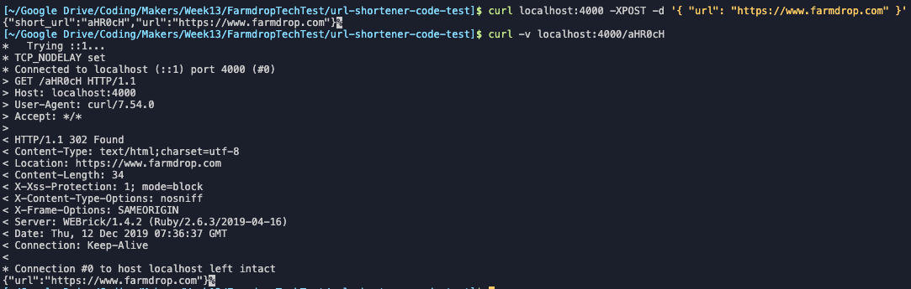
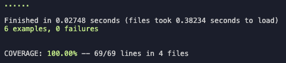

# Url Shortener Code Test

A URL shortening servise that creates short version of a URL that persists and could be shareable between different clients while the server is running.

<p align="center">
		 
[How to Install](#how-to-install) | [How to Use](#how-to-use) | [Tests](#tests) | [Approach](#approach) | [Original Instructions](#original-instructions) |
</p>

<br>

## How to Install

```
git clone git@github.com:ollyholly/url-shortener-tech-test.git
cd url-shortener-tech-tes
bundle install
```

<br>

## How to Use

Start a server by running `rackup -p 4000`.

1. To shorten a URL send a POST request with original link

```
curl localhost:4000 -XPOST -d '{ "url": "http://www.farmdrop.com" }'
```

responce

```
{ "short_url": "/abc123", "url": "http://www.farmdrop.com" }
```

2. To use short URL to get redirected to original link send a GET request to short URL route

```
curl -v localhost:4000/abc123
```

response

```
...
< HTTP/1.1 301 Moved Permanently
...
< Location: http://www.farmdrop.com
...
{ "url": "http://www.farmdrop.com" }
```

<br>


<br><br>

## Tests

Run `Rspec`



<br><br>

## Approach

### Structure

**app.rb** – UrlShortener – controller with POST route to submit original URL

**url_handler.rb** – UrlHandler – singleton class that validates, shortens and saves the shorten URL together with original one.

### Plan

- Create a POST route that parses request body and saves original URL
- Check if original URL has prefix (http, https), if not – add 'http://'
- Generate short URL by encoding original link to Base64
- Save short and original URL to a memory
- Return response with short and original URL in JSON format
- Create GET routes with custom URL
- Take short URL from params of the route and look for original URL in the memory
- If original URL is found, redirect to it and return a JSON body with short & original URL

**Additional features** (not implemented 🚧)

- create HTML form to send AJAX requests to get and display short URL without refreshing the page

**Edge cases & error handling**

- original URL doesn't have http, www, https ✅
- original URL is invalid 🚧
- error if original URL post request has empty body 🚧
- error if short URL is not found 🚧

<br><br>

## Original Instructions

Without using an external database, we'd like you to create a URL shortening
service. The URLs do not need to persist between restarts, but should be
shareable between different clients while the server is running.

- There should be an endpoint that responds to `POST` with a json body
  containing a URL, which responds with a JSON repsonse of the short url and
  the orignal URL, as in the following curl example:

```
curl localhost:4000 -XPOST -d '{ "url": "http://www.farmdrop.com" }'
{ "short_url": "/abc123", "url": "http://www.farmdrop.com" }
```

- When you send a GET request to a previously returned URL, it should redirect
  to the POSTed URL, as shown in the following curl example:

```
curl -v localhost:4000/abc123
...
< HTTP/1.1 301 Moved Permanently
...
< Location: http://www.farmdrop.com
...
{ "url": "http://www.farmdrop.com" }
```

Use whatever languages and frameworks you are comfortable with. Don't worry
about getting the whole thing working flawlessly, this is more to see how you
structure a program. Please don't spend more than a few hours on it.

Bonus points:

- I often forget to type "http://" at the start of a URL. It would be nice if
  this was handled by the application (frontend or backend is up to you).
- We like to see how you approach the problem, so a few git commits with a
  clear message about what you're doing are better than one git commit with
  everything in it.
- We like tests. We don't expect a full test suite, but some tests would be
  nice to see. Its up to you whether thats integration, unit or some other
  level of testing.
- We'd be very happy to see a Dockerfile to run the project. This by no means a
  requirement, so don't go reading the Docker docs if you've never worked with
  it.
- If you'd like to show off your frontend skills, you could create a simple
  frontend that can create and display shortened URLs without reloading the
  page.
